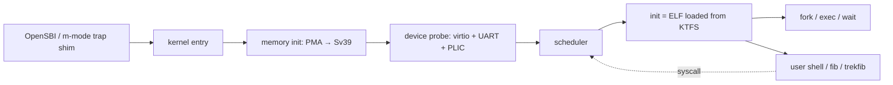

# riscv-mini-os

A small RISC-V kernel that boots on QEMU `virt`, schedules cooperatively
with preemption, runs ELF user processes from a hand-rolled on-disk
filesystem (KTFS), and supports `fork` / `exec` / `wait` over Sv39 paging.

| Subsystem        | What's there                                                      |
| ---------------- | ----------------------------------------------------------------- |
| Boot & traps     | M-mode shim, S-mode trap dispatcher, SIE/STIE plumbing            |
| Memory           | Sv39 page tables, kernel direct map, per-process user mspace      |
| Processes        | `fork` (page-table copy + COW-free), `exec` (ELF loader), `wait`  |
| Filesystem       | KTFS read/write driver with block cache and bitmap allocator      |
| Drivers          | virtio-mmio (block + entropy), UART, RTC, PLIC                    |
| Syscalls         | 15-call ABI (process, IO, FS), `ecall` trap path                  |
| Test bench       | 39 cases / 70 pt over kernel internals, hooked into `make run-test` |

The codebase began as the ECE 391 (UIUC) MP3 starter scaffold and was
substantively re-implemented as a personal portfolio project. See
[`NOTICE`](NOTICE) and the section on attribution at the bottom of this
README.

## Architecture at a glance



More diagrams (boot timeline, fork sequence, KTFS layout) live under
[`docs/`](docs/).

A static boot transcript is at
[`docs/img/demo.txt`](docs/img/demo.txt); regenerate it (or capture an
asciinema GIF on top of it) with `scripts/demo.sh`.

## Quick start

Tested on Ubuntu 22.04 / 24.04 with the riscv64-unknown-elf cross
toolchain and QEMU 7+. The setup script lists exact apt packages.

```sh
git clone https://github.com/Yoonkyu-Lee/riscv-mini-os.git
cd riscv-mini-os
./scripts/setup-ubuntu.sh        # apt-installs gcc-riscv64-unknown-elf, qemu, gdb
cd kernel
make                              # builds kernel.elf
make run-test                     # boots QEMU, runs the in-kernel test bench
make run INIT=trekfib             # boots into the fork+exec demo
```

`make run` packs `user/bin/*` into `ktfs.raw` (via `tools/mkfs_ktfs.py`)
and launches the kernel under QEMU virt. Pick a different starting
program with `INIT=...`:

| `INIT` value | What it does                                                 |
| ------------ | ------------------------------------------------------------ |
| `hello`      | Smoke test: print and exit                                   |
| `fib`        | Print Fibonacci numbers via the syscall console              |
| `trekfib`    | Fork: parent runs `fib`, child runs the trek game (default)  |
| `init`       | Minimal init that exec's another binary                      |
| `shell`      | Interactive REPL (added in Phase 11; planned)                |

## Test bench

`make run-test` reboots the kernel under a swapped entry point that
runs the suites in `tests/` and reports per-case scores. Current state:

```
==========================================
Functionality: 69/70
Penalties: none
Total: 69/70
==========================================
```

The single skipped point is `test_sys_exit`, intentionally skipped
because `_exit` is `noreturn` and would terminate the test runner.

The harness uses `setjmp`/`longjmp` over an S-mode trap-replacement
handler so a faulting test can return a `FAILED` row instead of
panicking the whole kernel. Cases also detect callee-saved register
clobbers via a wrapper shim (`tests/clobber.S`).

## Repository layout

```
riscv-mini-os/
├── kernel/         kernel sources (boot, traps, memory, processes, FS, drivers)
├── user/           user-mode programs and the C runtime they link against
├── tests/          test bench cases and the lightweight runner / fixtures
├── tools/          mkfs_ktfs.py + reader + round-trip tests (Python)
├── scripts/        setup-ubuntu.sh / build / run helpers
├── docs/           architecture, KTFS format, syscall ABI, memory map
├── DESIGN.md       end-to-end design walkthrough
├── LICENSE         University of Illinois/NCSA Open Source License (OSI)
├── NOTICE          attribution: UIUC ECE 391 starter + portfolio additions
└── AUTHORS         contributors
```

## Documentation

- [`DESIGN.md`](DESIGN.md) — end-to-end walk: boot, Sv39, syscalls,
  fork semantics, ELF loading, KTFS read/write, scheduler invariants
- [`docs/architecture.md`](docs/architecture.md) — cross-component diagrams
- [`docs/ktfs-format.md`](docs/ktfs-format.md) — superblock, inode,
  dentry layouts; bitmap encoding
- [`docs/syscall-abi.md`](docs/syscall-abi.md) — register convention,
  syscall numbers, return values
- [`docs/memory-map.md`](docs/memory-map.md) — physical map, MMIO ranges,
  Sv39 virtual map

## License & attribution

Distributed under the
[University of Illinois/NCSA Open Source License](LICENSE). The project
is a derivative work that builds on the ECE 391 MP3 starter scaffold
(build system, header conventions, device-driver stubs, test-bench
infrastructure). All starter files retain their original UIUC NCSA
notices unmodified, as the license requires; substantively new files
add a personal-author header on top.

See [`NOTICE`](NOTICE) for the full attribution boundary and
[`AUTHORS`](AUTHORS) for the list of contributors.

## Acknowledgments

ECE 391 Course Staff at the University of Illinois at Urbana-Champaign,
for the educational scaffolding this project grew out of.
