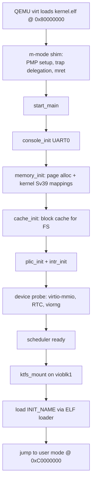
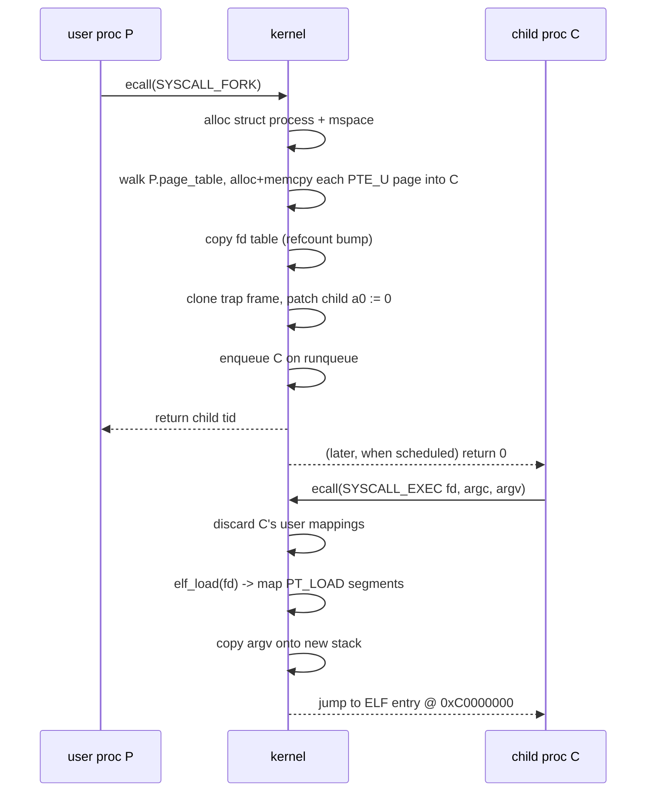
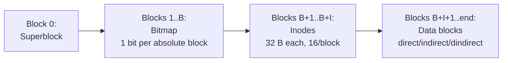

# Architecture diagrams

Cross-component diagrams. For text walk-through see
[`../DESIGN.md`](../DESIGN.md).

## Boot flow



## fork + exec sequence



## KTFS image layout



## Inode reachability tree

```mermaid
flowchart LR
    INODE[inode]
    INODE --> D0[direct[0]]
    INODE --> D1[direct[1]]
    INODE --> D2[direct[2]]
    INODE --> IND[indirect index page<br/>128 ptrs]
    IND --> ID0[data]
    IND --> ID1[data]
    IND --> IDN[...128 data]
    INODE --> DI0[dindirect[0] outer<br/>128 ptrs]
    INODE --> DI1[dindirect[1] outer<br/>128 ptrs]
    DI0 --> IN0[inner index<br/>128 ptrs] --> DD0[16384 data]
```
